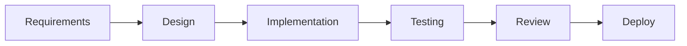
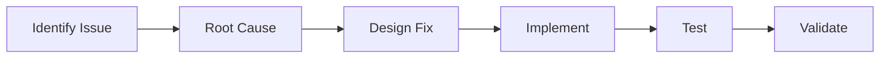

# AI Assistant Documentation Hub

A comprehensive guide for integrating AI assistants into your development workflow. These templates help establish consistent, effective collaboration between different AI models and human developers.

## 📚 Documentation Structure

### Core Guidelines

- **[CLAUDE.md](./CLAUDE.md)** - Guidelines for Claude Code and similar AI assistants
  - Root cause analysis methodology
  - Common mistakes and how to avoid them
  - Multi-model collaboration patterns
  - MCP server integration (when available)
  - Project-specific configuration template

- **[AGENTS.md](./AGENTS.md)** - Multi-agent collaboration framework
  - Agent roles and strengths
  - Hand-off protocols between assistants
  - Task delegation patterns
  - Collaboration workflows

- **[MCP_SETUP.md](./MCP_SETUP.md)** - MCP server setup guide
  - One-line Codex setup
  - Adding other MCP servers
  - Security options
  - Troubleshooting

### Configuration Examples

- **[mcp-config-example.json](./mcp-config-example.json)** - Simple MCP config template
- **[.env.example](./.env.example)** - Environment variables template

## 🚀 Quick Start

### 1. Enable MCP Integration (One Command!)

```bash
# Install Codex CLI if needed
npm install -g @openai/codex

# Add Codex MCP server to Claude (macOS/Linux)
claude mcp add codex -s user -e OPENAI_API_KEY=$OPENAI_API_KEY -- codex mcp -m gpt-5 -c model_reasoning_effort="high"

# Windows PowerShell variant
claude mcp add codex -s user -e OPENAI_API_KEY=$env:OPENAI_API_KEY -- codex mcp -m gpt-5 -c model_reasoning_effort="high"

# Restart Claude Desktop - Done! 🎉
```

### 2. Quick Smoke Test (60 seconds)

Test the integration immediately:

1. In Claude, ask: "Can you work with Codex to create a test file?"
2. Claude should delegate to Codex to:
   - Create `test-codex-integration.txt` with "Hello from Codex!"
   - Show the file contents
   - Delete the file
3. Success = file created, shown, and removed with no other changes

### 3. Copy Templates to Your Project

```bash
# Clone or download these templates
cp -r docs/ai-assistants /path/to/your/project/docs/

# Customize for your project
cd /path/to/your/project/docs/ai-assistants
```

### 4. Configure for Your Project

Edit the configuration section in CLAUDE.md:

```yaml
# In CLAUDE.md - Add your project details
project:
  name: "Your Project Name"
  type: "web|cli|library|service"
  language: "TypeScript|Python|Go|etc"
  
conventions:
  style_guide: "link-to-style-guide"
  test_framework: "jest|pytest|etc"
  min_coverage: 80
```

## 🤝 Collaboration Protocol

### Working with AI Assistants

1. **Primary Orchestrator** (Claude Code or similar)
   - Architecture design and planning
   - Complex reasoning and debugging
   - Security review and validation
   - Task delegation management

2. **Implementation Specialist** (Codex/GPT via MCP)
   - Rapid parallel implementation
   - Test suite generation
   - Documentation creation
   - Boilerplate code

### How Codex Works

**Key Behaviors:**
- **Sandbox**: Default `workspace-write` (can modify project files)
- **Approvals**: Required for destructive ops, network access, Docker
- **Communication**: Shows brief preambles before actions, maintains visible step plans
- **File Editing**: Uses minimal diffs via `apply_patch`, no auto-commits
- **Reading**: Processes ~250 lines at a time, prefers `rg` for search
- **Network**: Restricted by default, requires approval for `npm install`, etc.

### Visibility Protocol

Always announce collaborations transparently:

```
🤝 Working with [Assistant] on: [task description]
   Reason: [why this assistant is suited]
   Expected outcome: [what will be delivered]
```

## 🛑 Universal Best Practices

### 1. Root Cause Analysis

**NEVER** patch symptoms without understanding:
- What is the actual error?
- Where in the chain does it fail?
- What are the root causes?
- How can we prevent recurrence?

### 2. Code Quality Standards

- Minimum 80% test coverage
- Follow existing patterns
- Document complex logic
- No mock data when real APIs exist
- Security review for all changes

### 3. Communication

- Clear task descriptions
- Explicit success criteria
- Regular progress updates
- Transparent error reporting

## 📋 Implementation Workflows

### Feature Development


### Bug Fixing


## 🛠️ Customization Guide

### For Web Applications

```yaml
# Emphasize these sections:
- API patterns and endpoints
- Frontend/backend separation
- State management
- Testing strategies
```

### For CLI Tools

```yaml
# Focus on:
- Command structure
- Input/output formatting
- Error handling
- Shell integration
```

### For Libraries

```yaml
# Prioritize:
- API design
- Documentation
- Version management
- Backward compatibility
```

## 🛡️ Security Checklist

### Before Starting
- [ ] Start Codex in `read-only` mode for initial testing
- [ ] Store API keys in environment variables, never in code
- [ ] Review your `.gitignore` includes `.env` files

### During Development
- [ ] Require approvals for destructive operations (`rm`, `git reset`)
- [ ] Review diffs before applying large patches
- [ ] Never pass secrets directly in prompts
- [ ] Restrict network access unless explicitly needed

### Best Practices
- [ ] Use project-specific API keys when possible
- [ ] Flip to `workspace-write` only after smoke test passes
- [ ] Keep sensitive operations in `untrusted` approval mode
- [ ] Audit Codex actions in production environments

## 📊 Success Metrics

Track these across AI collaborations:

| Metric | Target | Measurement |
|--------|--------|-------------|
| Test Coverage | >80% | Coverage reports |
| Build Success | 100% | CI/CD pipeline |
| Code Quality | A | Linting scores |
| Documentation | Complete | Review checklist |
| Performance | <100ms | Profiling tools |

## 🔧 Tool Integration

### VS Code Extensions
- GitHub Copilot
- Continue.dev
- Codeium
- TabNine

### Command Line Tools
- GitHub CLI
- OpenAI CLI
- Claude CLI

### CI/CD Integration
- GitHub Actions
- GitLab CI
- Jenkins
- CircleCI

## 📚 Additional Resources

### Official Documentation
- [Claude Documentation](https://docs.anthropic.com)
- [OpenAI Platform](https://platform.openai.com)
- [GitHub Copilot](https://copilot.github.com)

### Community Resources
- [AI Coding Best Practices](https://github.com/topics/ai-coding)
- [Prompt Engineering Guide](https://github.com/dair-ai/Prompt-Engineering-Guide)
- [LLM Integration Patterns](https://github.com/topics/llm-integration)

## 🤔 When to Use These Templates

✅ **Use when you want to:**
- Establish consistent AI collaboration
- Document project-specific guidelines
- Onboard new AI assistants quickly
- Maintain code quality standards
- Track and improve AI workflows

❌ **Don't use if:**
- Your project is too simple for AI assistance
- You have regulatory restrictions on AI use
- Your codebase is not in version control
- You lack API access to AI models

## 🔄 Continuous Improvement

This is a living documentation set. Update it based on:

1. **Lessons Learned** - What worked? What didn't?
2. **New Patterns** - Discovered better approaches?
3. **Tool Updates** - New features or capabilities?
4. **Team Feedback** - What do developers need?

## 📝 Contributing

To improve these templates:

1. Fork the repository
2. Make your improvements
3. Test with real projects
4. Submit a pull request
5. Share your experiences

## 📄 License

These templates are provided as-is for use in any project. Customize freely for your needs.

---

*Version 1.0 - Generic AI Assistant Documentation Templates*